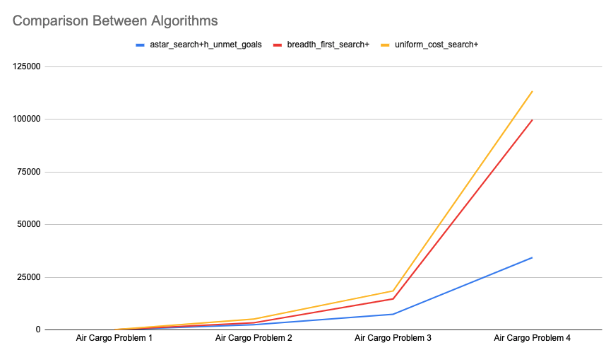

# Project: Build a Forward Planning
All the problems at hand consists in moving cargo between airports 

The actions are 

~~~
Action(Load(c, p, a),
PRECOND: At(c, a) ∧ At(p, a) 
EFFECT: ¬ At(c, a) ∧ In(c, p)) 

Action(Unload(c, p, a),
PRECOND: In(c, p) ∧ At(p, a) 
EFFECT: At(c, a) ∧ ¬ In(c, p)) 

Action(Fly(p, from, to),
PRECOND: At(p, from) ∧ Plane(p) 
EFFECT: ¬ At(p, from) ∧ At(p, to))
~~~

Four instances of the problems with an increasing number of predicates were used to test the different approaches

| Problem | Airports | Cargos | Planes | Ground Predicates | Actions |
| :-: | :-: | :-: | :-: | :-: | :-: |
| Air Cargo Problem 1 | 2 | 2 | 2 | 12 | 20 |
| Air Cargo Problem 2 | 3 | 3 | 3 | 27 | 72 |
| Air Cargo Problem 3 | 4 | 4 | 2 | 32 | 88 |
| Air Cargo Problem 4 | 4 | 5 | 2 | 38 | 104 |

All instances were tested using pypy3.

As the problem size increases in the following sections it will be shown how the search time and the number of nodes expands proportionally. For example for the smaller problems 1 and 2 all the algorithms are able to find a solution, in the bigger problems like Air Cargo Problem 3 and 4 instead, several algorithms are unable to find a solution. DFS, for example, given its incompleteness is unable to find a solution in larger problems, since it has to explore the complete depth of the tree before backtracking. In the figure below it can be see how BFS expanses a number of nodes exponentially proportional to the number of actions: 

## Air Cargo Problem 1

PDDL Description:

~~~
Init({At(C1, SFO), At(C2, JFK), At(P1, SFO), At(P2, JFK)})
Goal({At(C1, JFK),At(C2, SFO)})
~~~

Results:

| Search Strategy | Heuristic | Planning Time | Expansions | New Nodes |
| :-: | :-: | :-: | :-: | :-: | 
| BFS |  | 0,020 | 43 | 56 | 178 |
| DFS |  | 0,005 | 21 | 22 | 84 |
| UFC |  | 0,016 | 60 | 62 | 240 |
| **GBFS** | **UnmetGoals** | **0,002** | **7** | **9** | **29** |
| GBFS | PG-LevelSum | 0,463 | 6 | 8 | 28 |
| GBFS | PG-MaxLevel | 0,102 | 6 | 8 | 24 |
| GBFS | PG-SetLevel | 0,501 | 6 | 8 | 28 |
| A* | UnmetGoals | 0,012 | 50 | 52 | 206 |
| A* | PG-LevelSum | 0,374 | 28 | 30 | 122 |
| A* | PG-MaxLevel | 0,186 | 43 | 45 | 180 |
| A* | PG-SetLevel | 0,551 | 33 | 35 | 138 |

## Air Cargo Problem 2
PDDL Description

~~~
Init({At(C1, SFO), At(C2, JFK), At(C3, ATL), At(P1, SFO), At(P2, JFK), At(P3, ATL)})
Goal({At(C1, JFK), At(C2, SFO), At(C3, SFO)})
~~~

| Search Strategy | Heuristic | Planning Time | Expansions | New Nodes |
| :-: | :-: | :-: | :-: | :-: | 
| BFS |  | 0,321 | 3343 | 4609 | 30503 |
| DFS |  | 0,512 | 624 | 625 | 5602 |
| UFC |  | 0,590 | 5154 | 5156 | 46618 |
| **GBFS** | **UnmetGoals** | **0,009** | **17** | **19** | **170** |
| GBFS | PG-LevelSum | 1,532 | 9 | 11 | 86 |
| GBFS | PG-MaxLevel | 1,126 | 27 | 29 | 249 |
| GBFS | PG-SetLevel | 4,017 | 9 | 11 | 84 |
| A* | UnmetGoals | 0,663 | 2467 | 2469 | 22522 |
| A* | PG-LevelSum | 42,549 | 357 | 359 | 3426 |
| A* | PG-MaxLevel | 136,147 | 2887 | 2889 | 26594 |
| A* | PG-SetLevel | 409,708 | 1037 | 1039 | 9605 |

## Air Cargo Problem 3
PDDL Description

~~~
Init({At(C1, SFO), At(C2, JFK), At(C3, ATL), At(C4, ORD), At(P1, SFO), At(P2, JFK)})
Goal({At(C1, JFK), At(C2, SFO), At(C3, JFK), At(C4, SFO)})
~~~

| Search Strategy | Heuristic | Planning Time | Expansions | New Nodes |
| :-: | :-: | :-: | :-: | :-: | 
| BFS |  | 0,951 | 14663 | 18098 | 129625 |
| DFS |  | - | - | - | - |
| UFC |  | 1,672 | 18510 | 18512 | 161936 |
| **GBFS** | **UnmetGoals** | **0,015** | **25** | **27** | **230** |
| GBFS | PG-LevelSum | 5,999 | 14 | 16 | 126 |
| GBFS | PG-MaxLevel | - | - | - | - |
| GBFS | PG-SetLevel | - | - | - | - |
| A* | UnmetGoals | 2,827 | 7388 | 7390 | 65711 |
| A* | PG-LevelSum | 86,352 | 369 | 371 | 3403 |
| A* | PG-MaxLevel | - | - | - | - |
| A* | PG-SetLevel | - | - | - | - |

## Air Cargo Problem 4

~~~
Init({At(C1, SFO), At(C2, JFK), At(C3, ATL), At(C4, ORD), At(C5, ORD), At(P1, SFO), At(P2, JFK)})
Goal({At(C1, JFK), At(C2, SFO), At(C3, JFK), At(C4, SFO), At(C5, JFK)})
~~~

| Search Strategy | Heuristic | Planning Time | Expansions | New Nodes |
| :-: | :-: | :-: | :-: | :-: | 
| BFS |  | 6,773 | 99736 | 114953 | 944130 |
| DFS |  | - | - | - | - |
| UFC |  | 11,018 | 113339 | 113341 | 1066413 |
| **GBFS** | **UnmetGoals** | **0,028** | **29** | **31** | **280** |
| GBFS | PG-LevelSum | 7,131 | 17 | 19 | 165 |
| GBFS | PG-MaxLevel | - | - | - | - |
| GBFS | PG-SetLevel | - | - | - | - |
| A* | UnmetGoals | 5,182 | 34330 | 34332 | 328509 |
| A* | PG-LevelSum | - | - | - | - |
| A* | PG-MaxLevel | - | - | - | - |
| A* | PG-SetLevel | - | - | - | - |

## Questions

#### Which algorithm or algorithms would be most appropriate for planning in a very restricted domain (i.e., one that has only a few actions) and needs to operate in real time?

For very restricted domains Breadth First Search and Greedy Best First Search with the Unmet Heuristic are the most appropriate

#### Which algorithm or algorithms would be most appropriate for planning in very large domains (e.g., planning delivery routes for all UPS drivers in the U.S. on a given day)

For planning in very large domains restricted domains Uniform Cost Search and Greedy Best First Search with the Unmet Heuristic are the most appropriate

#### Which algorithm or algorithms would be most appropriate for planning problems where it is important to find only optimal plans?

If it's important to find only optimal plans, the most appropriate is BFS and an A* with admissible heuristic like PG-MaxLevel or PG-SetLevel

## Personal Comment
I expect to fail this assignment. Sincerely, I cannot get my head around on the fact that the uninformed search algorithms work better than the informed ones, specially when increasing the branching factor. Moreover, I cannot understand why all this part of the course is centred on the PlanningGraph algorithms and these methods work worse than all the others. 

I looked thoroughly at my code and I cannot understand what I'm doing wrong; the functions that I needed to implement are pretty atomic and I also implemented the heuristics in the iterative way as provided in the pseudocode. All the tests pass both locally and the autograder. I tried to ask on the Knowledge Center, but I was given a pretty [useless answer by a mentor](https://knowledge.udacity.com/questions/604973). 

If instead the things are supposed to be like this I think that this project is not educating